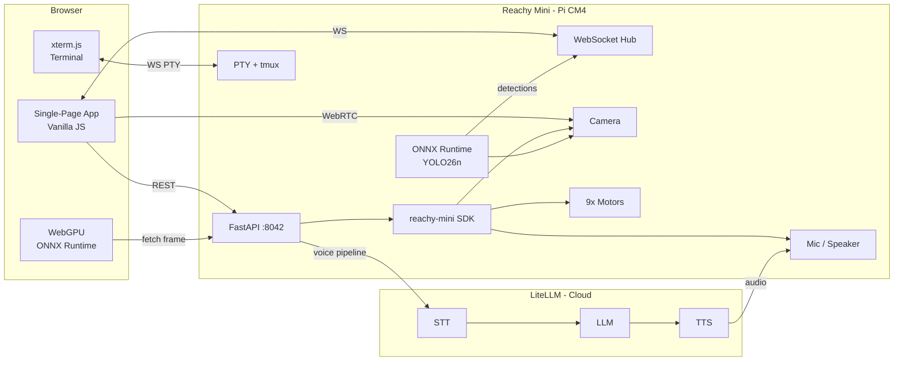
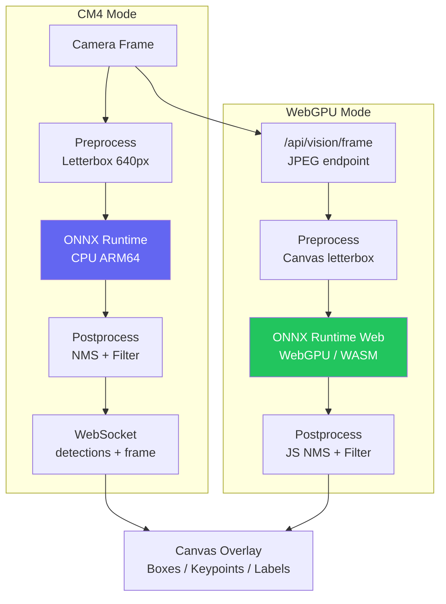
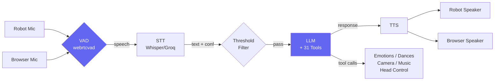
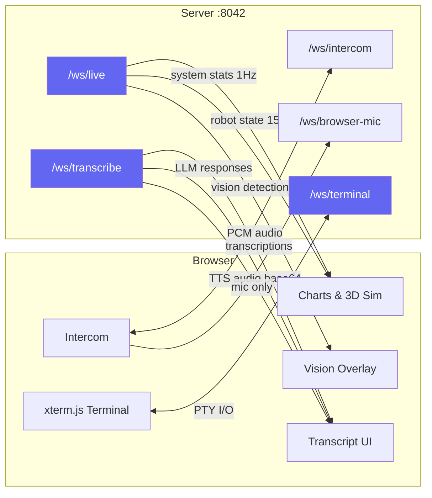

<div align="center">

# Hello World — One App to Rule Them All

### Unbox your Reachy Mini. Install Hello World. Everything works.

[](https://huggingface.co/spaces/panny247/hello_world)
[](https://huggingface.co/spaces/panny247/hello_world?duplicate=true)


The app that gives every Reachy Mini owner a running start — and a platform for developers to build upon.

> **Hit the ground running.** AI conversation, real-time YOLO vision, 81 emotions, system monitoring, browser terminal, and full robot control. One install, one dashboard, everything you need.
>
> **Build on top of it.** 146 REST endpoints. OpenAPI spec. 23 modular Python API files. Fork it, extend it, make it yours.
>
> **Lightweight by design.** Pure Python + vanilla JS. No React, no bundler, no node_modules. Runs on a Raspberry Pi CM4 with 4GB RAM.

<p align="center">
  
</p>

</div>

---

## Why This Exists

<table>
<tr>
<td width="33%" valign="top">

### Hit the Ground Running
Reachy Mini ships with basic demos. This app gives every new owner **everything** on day one: AI conversation with 31 tools, real-time YOLO vision, 81 emotions, 20 dances, system monitoring, a web shell, music playback, timers, Bluetooth audio, and full motor control. Install it once, open a browser, and your robot is alive.

</td>
<td width="33%" valign="top">

### A Platform to Build Upon
Not just an app — a **developer platform**. 146 documented REST endpoints with a full OpenAPI spec. Modular Python architecture: each feature is a self-contained module you can study, modify, or replace. Fork it, add your own API endpoints, build new tabs. The codebase is designed to be read and extended.

</td>
<td width="33%" valign="top">

### Lightweight by Design
Pure Python + vanilla JavaScript. No React, no Vue, no bundler, no node_modules, no build step. The entire app runs on a **Raspberry Pi CM4 with 4GB RAM**. Clone the repo, `pip install -e .`, restart the daemon — you're live in under a minute. Every dependency earns its place.

</td>
</tr>
</table>

---

## See It in Action

### AI Conversation with 31 Tools

Ask Reachy anything — it reasons with 31 tools, moves its head, plays emotions, takes photos, and controls music. All through natural voice conversation.

<p align="center">
  
</p>

### Real-time YOLO Vision

Object detection, pose estimation, and segmentation running live on the camera — on the Pi's ARM CPU (ONNX Runtime) or your browser's GPU (WebGPU).

<p align="center">
  
</p>

### 81 Emotions with 3D Preview

Browse the full library, preview any animation on the 3D model, then play it on the physical robot.

<p align="center">
  
</p>

---

## What Makes This Different

<table>
<tr>
<td width="50%" valign="top">

### Dual ONNX Runtime Vision Pipeline
Real-time YOLO inference on **two backends simultaneously** — ONNX Runtime on ARM64 (Pi CM4) and ONNX Runtime Web via WebGPU in the browser. The CM4 runs nano models at 5-8 FPS for always-on detection; the browser GPU accelerates larger models to 30-60 FPS for detailed analysis. Both share results through a unified WebSocket channel, and the robot reacts to what it sees.

</td>
<td width="50%" valign="top">

### 31-Tool Autonomous AI Agent
Not just a chatbot — a fully embodied AI that can see, move, listen, speak, play music, set timers, take photos, record video, control motors, and create HTML visualizations. Built on LiteLLM for provider-agnostic access to OpenAI, Anthropic, Groq, Gemini, and DeepSeek. The voice pipeline chains VAD, STT, LLM (with tool calling), and TTS into a seamless conversational loop.

</td>
</tr>
<tr>
<td width="50%" valign="top">

### MuJoCo-Class 3D Simulation
Full URDF robot model rendered with Three.js and post-processing (bloom, SMAA). Live WebSocket pose data at 15Hz creates a real-time digital twin. Skin textures, background scenes, interactive orbit controls. Every emotion and dance can be previewed in 3D before playing on the physical robot.

</td>
<td width="50%" valign="top">

### 146 Endpoints, Zero Build Steps
The backend exposes a full REST API with OpenAPI documentation — every feature is programmable. The frontend is 24 vanilla JS modules with no framework, no transpilation, no bundler. Read the source, change it, reload. This is a codebase designed for developers who want to understand what they're running.

</td>
</tr>
</table>

---

## Technology Stack

<table>
<tr>
<th width="30%">Category</th>
<th width="70%">Technologies</th>
</tr>
<tr>
<td><strong>NVIDIA Ecosystem</strong></td>
<td>
<strong>ONNX Runtime</strong> (ARM64 CPU inference on Pi CM4) &bull;
<strong>ONNX Runtime Web</strong> (WebGPU + WASM browser inference) &bull;
<strong>MuJoCo</strong> (physics-grade URDF robot model)
</td>
</tr>
<tr>
<td><strong>Pollen Robotics</strong></td>
<td>
<strong>reachy-mini SDK</strong> (ReachyMiniApp base class, motor control, audio pipeline) &bull;
<strong>Reachy Mini</strong> (9-DOF expressive robot head, Pi CM4, camera, mic/speaker)
</td>
</tr>
<tr>
<td><strong>HuggingFace</strong></td>
<td>
<strong>HuggingFace Hub</strong> (on-demand YOLO model downloads with disk space checking) &bull;
<strong>HuggingFace Spaces</strong> (community distribution)
</td>
</tr>
<tr>
<td><strong>AI / ML</strong></td>
<td>
<strong>YOLO v8/11</strong> (detection, pose, segmentation, open vocabulary) &bull;
<strong>LiteLLM</strong> (unified multi-provider LLM/TTS/STT) &bull;
<strong>webrtcvad</strong> (voice activity detection)
</td>
</tr>
<tr>
<td><strong>Backend</strong></td>
<td>
<strong>FastAPI</strong> (146 REST endpoints + 6 WebSocket channels) &bull;
<strong>Python 3.10+</strong> &bull;
<strong>OpenCV</strong> (image processing, video recording)
</td>
</tr>
<tr>
<td><strong>Frontend</strong></td>
<td>
<strong>Vanilla JavaScript</strong> (zero framework, 24 modules) &bull;
<strong>Three.js</strong> (3D URDF rendering) &bull;
<strong>xterm.js</strong> (terminal emulator) &bull;
<strong>WebRTC</strong> (camera streaming) &bull;
<strong>WebGPU</strong> (browser-side ML inference)
</td>
</tr>
</table>

---

## Quick Start

```bash
# Clone and install (on your Reachy Mini, in the apps venv)
git clone https://huggingface.co/spaces/panny247/hello_world
cd hello_world
pip install -e .

# Restart the daemon — it discovers the app automatically
reachy-restart

# Open your browser
# http://reachy-mini.local:8042
```

That's it. No build step, no `npm install`, no configuration files to edit. The app works out of the box — all URLs default to `localhost`. Add your AI provider API keys in the UI when you're ready for conversation and vision features.

> [!TIP]
> **Want to add your own feature?** Every module in `api/` follows the same pattern. Create a file, add a `register_routes(app)` function, wire it in `api/__init__.py`:
> ```python
> # api/my_feature.py — that's all you need
> def register_routes(app) -> None:
>     @app.settings_app.get("/api/my-feature/status")
>     async def get_status():
>         return {"status": "ok"}
> ```
> Full OpenAPI spec at `/openapi.json`. See [Project Structure](#project-structure) for the complete layout.

---

## Architecture Overview



---

## Feature Tour

<div class="grid lg:grid-cols-3 gap-x-4 gap-y-7">
  <div>
    <div class="w-full h-40 mb-2 rounded-lg flex items-start justify-start overflow-hidden bg-gray-900">
      
    </div>
    <div><strong>System Telemetry</strong> -- 12 live charts: CPU, RAM, disk, network, WiFi, fan, thermal, I/O</div>
  </div>
  <div>
    <div class="w-full h-40 mb-2 rounded-lg flex items-start justify-start overflow-hidden bg-gray-900">
      
    </div>
    <div><strong>3D Digital Twin</strong> -- URDF model with live pose data at 15Hz, skin textures, scenes</div>
  </div>
  <div>
    <div class="w-full h-40 mb-2 rounded-lg flex items-start justify-start overflow-hidden bg-gray-900">
      
    </div>
    <div><strong>81 Emotions + 20 Dances</strong> -- Searchable gallery with 3D preview and category filters</div>
  </div>
  <div>
    <div class="w-full h-40 mb-2 rounded-lg flex items-start justify-start overflow-hidden bg-gray-900">
      
    </div>
    <div><strong>AI Conversation</strong> -- 31 tools, multi-provider via LiteLLM, voice pipeline</div>
  </div>
  <div>
    <div class="w-full h-40 mb-2 rounded-lg flex items-start justify-start overflow-hidden bg-gray-900">
      
    </div>
    <div><strong>YOLO Vision</strong> -- Detection, pose, segmentation, open vocab (CM4 + WebGPU)</div>
  </div>
  <div>
    <div class="w-full h-40 mb-2 rounded-lg flex items-start justify-start overflow-hidden bg-gray-900">
      
    </div>
    <div><strong>Browser Terminal</strong> -- xterm.js + tmux, persistent sessions, REST API</div>
  </div>
  <div>
    <div class="w-full h-40 mb-2 rounded-lg flex items-start justify-start overflow-hidden bg-gray-900">
      
    </div>
    <div><strong>Media Library</strong> -- Snapshots, recordings, music with metadata and cover art</div>
  </div>
  <div>
    <div class="w-full h-40 mb-2 rounded-lg flex items-start justify-start overflow-hidden bg-gray-900">
      
    </div>
    <div><strong>Timers & Ambient</strong> -- Countdown timers, alarms, ambient sounds with sleep timers</div>
  </div>
  <div>
    <div class="w-full h-40 mb-2 rounded-lg flex items-start justify-start overflow-hidden bg-gray-900">
      
    </div>
    <div><strong>Scratchpad</strong> -- Generative UI: AI creates charts, diagrams, tables on demand</div>
  </div>
</div>

### Floating Panels

Two persistent panels hover above every tab:

- **Camera Panel** -- Live WebRTC camera feed with snapshot capture, video recording, mic recording, and listen/speak buttons. Supports robot camera and any browser camera (laptop webcam, iPhone Continuity Camera, USB cameras) via a unified Camera Registry.
- **Joystick Panel** -- 5-axis head control: look direction, z/roll, x/y translation, body rotation, and individual antenna control. Return-to-center toggle for smooth operation.

Both panels are draggable, resizable, minimizable, and remember their position across sessions. Bluetooth audio routing (A2DP at 48kHz) and 43 searchable help topics round out the feature set.

---

## NVIDIA Ecosystem Integration

### ONNX Runtime: Dual-Backend Vision Pipeline

This project demonstrates ONNX Runtime running on two fundamentally different backends simultaneously, connected through a shared WebSocket detection channel:



| | CM4 Backend | WebGPU Backend |
|---|---|---|
| **Runtime** | ONNX Runtime (ARM64 CPU) | ONNX Runtime Web (WebGPU/WASM) |
| **Hardware** | Raspberry Pi CM4 | Any modern browser GPU |
| **Models** | Nano (~5 MB) | Nano, Small, Medium |
| **Speed** | ~5-8 FPS | ~30-60 FPS |
| **Model Source** | HuggingFace Hub (on-demand download) | HuggingFace Hub (on-demand download) |
| **Vision Tasks** | Detection, Pose, Segmentation, Open Vocab | Detection, Pose, Segmentation, Open Vocab |

Models are downloaded on demand from HuggingFace Hub with automatic disk space checking (the Pi CM4 has limited eMMC storage). The dual-backend approach lets developers choose the right tradeoff: always-on lightweight inference on the edge device, or high-performance GPU-accelerated analysis when a browser is connected.

### MuJoCo: Physics-Grade Robot Model

The 3D simulation uses the robot's URDF model (the same format used by MuJoCo and other physics simulators) rendered with Three.js and post-processing effects. The simulation receives live pose data at 15Hz over WebSocket, creating a real-time digital twin. Pre-computed joint angle data lets users preview all 101 animations (81 emotions + 20 dances) in 3D before playing them on the physical robot.

### WebGPU: Browser-Side ML Inference

The WebGPU backend uses ONNX Runtime Web v1.20.0 to run YOLO models directly in the browser's GPU. This offloads compute-intensive inference from the resource-constrained Pi CM4, achieving 4-10x higher frame rates. The implementation includes letterbox preprocessing on canvas, JavaScript NMS post-processing, and a detection overlay renderer — all running client-side with zero server load.

---

## Voice Pipeline



The voice listener runs a headless pipeline:
- **VAD**: webrtcvad (aggressiveness 2), 30ms frames, 1s silence timeout, 300ms minimum speech
- **Audio Input**: Robot mic (SDK) or browser mic (via WebSocket)
- **Audio Output**: Robot speaker (SDK `push_audio_sample`) or browser (WebSocket base64 WAV)
- **TTS Queue**: Serialized via lock — one speaker at a time, no overlapping speech
- **Antenna Wiggle**: Physical feedback on speech detection (3-pattern rotation)

### AI Provider Support

All providers accessed via [LiteLLM](https://github.com/BerriAI/litellm) — enter your API keys in the UI.

| Capability | Providers |
|-----------|-----------|
| **STT** | OpenAI Whisper, Groq |
| **LLM** | OpenAI, Anthropic, Groq, Gemini, DeepSeek |
| **TTS** | OpenAI, ElevenLabs, Groq Orpheus, Gemini |
| **VLM** | Vision-capable models auto-detected per provider |
| **Web Search** | Anthropic, Gemini (always); OpenAI, Groq (model-dependent) |

Provider capabilities and available models are discovered dynamically from live API calls (cached 10 minutes).

### What You Can Ask Reachy

> [!NOTE]
> The AI assistant has **31 tools** it can call autonomously during conversation. It decides which tools to use based on your request — no manual selection needed.

<details>
<summary><strong>View all 31 tools with example prompts</strong></summary>

| Tool | What it does | Example prompt |
|------|-------------|----------------|
| **ignore** | Skip background noise / non-directed speech | *(called automatically ~95% of ambient audio)* |
| **play_emotion** | Play one of 81 emotion animations | "Show me you're happy" / "Are you scared?" |
| **play_dance** | Play one of 20 dance moves | "Dance for me" / "Do the chicken peck" |
| **set_head_pose** | Move head (yaw/pitch/roll) | "Look left" / "Nod your head" |
| **take_snapshot** | Capture camera image + VLM description | "Take a photo" / "What do you see?" |
| **start_recording** | Record video from the camera | "Record a 10 second video" |
| **stop_recording** | Stop video recording | "Stop recording" |
| **start_sound_recording** | Record audio from the mic | "Record what you hear" |
| **stop_sound_recording** | Stop audio recording | "Stop the audio recording" |
| **play_music** | Play a track on the robot speaker | "Play some music" |
| **stop_music** | Stop music playback | "Stop the music" |
| **list_music** | List available tracks | "What music do you have?" |
| **get_system_status** | Get CPU, RAM, uptime, etc. | "How are your systems?" |
| **get_date_time** | Get current date and time | "What time is it?" |
| **see_objects** | YOLO object detection through camera | "What objects do you see?" / "Is anyone there?" |
| **set_timer** | Set a countdown timer with name | "Set a timer for 5 minutes for pasta" |
| **check_timers** | Check status of active timers | "How much time is left on the pasta timer?" |
| **cancel_timer** | Cancel a running timer | "Cancel the pasta timer" |
| **set_alarm** | Set a recurring or one-shot alarm | "Set an alarm for 7 AM" |
| **manage_alarm** | List, cancel, snooze, or toggle alarms | "Snooze my morning alarm" |
| **play_ambient** | Play looping ambient sounds with sleep timer | "Play rain sounds for 30 minutes" |
| **stop_ambient** | Stop ambient sound playback | "Stop the rain sounds" |
| **search_help** | Search the 43 built-in help topics | "How do I use the joystick?" |
| **create_scratchpad** | Create rich HTML visualizations | "Show me a chart of CPU usage" |
| **set_volume** | Adjust master, speech, music, or effects volume | "Turn the volume up" / "Set music to 50%" |
| **start_oscillation** | Start a head movement pattern | "Sway your head gently" |
| **stop_oscillation** | Stop head oscillation | "Stop swaying" |
| **set_motor_mode** | Change motor mode (enabled/disabled/gravity) | "Turn off your motors" |
| **set_vision_mode** | Switch vision mode (off/cm4/webgpu) | "Start object detection" |
| **control_listener** | Start, stop, or mute the voice listener | "Stop listening for a bit" |
| **bluetooth_manage** | Scan, pair, connect Bluetooth devices | "Find Bluetooth speakers" |

</details>

---

## WebSocket Architecture

Six WebSocket channels handle all real-time communication — no polling anywhere in the system:



| Endpoint | Direction | Rate | Purpose |
|----------|-----------|------|---------|
| `/ws/live` | server &rarr; client | Configurable (15Hz robot, 1Hz stats) | Robot state, system stats, vision detections, camera frames |
| `/ws/intercom` | bidirectional | Real-time | Browser mic PCM &rarr; robot speaker; robot mic &rarr; browser |
| `/ws/browser-mic` | client &rarr; server | Real-time | Browser mic only (feeds listener, no speaker feedback) |
| `/ws/transcribe` | server &rarr; client | Event-driven | Transcriptions, LLM responses, tool calls, TTS audio, errors |
| `/ws/camera` | client &rarr; server | Configurable (2 FPS default) | Browser camera JPEG frames for vision/snapshots/recording |
| `/ws/terminal` | bidirectional | Real-time | PTY terminal via shared tmux session (xterm.js client) |

### /ws/live Subscriptions

Clients send `{"subscribe": ["robot", "stats", "vision"]}` to control data flow:

- **robot**: head_pose (x/y/z/roll/pitch/yaw), joint angles, antennas, errors
- **stats**: CPU, RAM, disk, network, WiFi, load, fan, throttle, disk I/O, processes
- **vision**: detection results + base64 JPEG camera frames (when CM4 mode active)

---

## Project Structure

```
hello_world/
├── main.py               # Entry point (imports HelloWorld)
├── app.py                # ReachyMiniApp subclass, 50Hz main loop
├── config.py             # Centralized config (@dataclass, env var overrides)
├── settings.py           # JSON settings persistence (load/save/defaults)
├── stats.py              # 12 system telemetry functions
├── websocket.py          # 6 WebSocket endpoints
├── vision_inference.py   # CM4 ONNX Runtime inference engine (threaded)
├── api/
│   ├── __init__.py       # Auto-discovery route registration (23 modules)
│   ├── conversation/     # LLM chat, tool calling, provider discovery
│   │   ├── discovery.py  # Provider/model/voice discovery + caches
│   │   ├── prompts.py    # System prompt, 31 tool definitions
│   │   ├── tool_executor.py  # Tool dispatch (31 branches)
│   │   ├── tts.py        # TTS playback (robot + browser routing)
│   │   └── chat.py       # Chat endpoint, history, Pydantic models
│   ├── listener.py       # Headless voice pipeline (VAD + STT + LLM + TTS)
│   ├── vision.py         # YOLO vision mode switching + model management
│   ├── oscillation.py    # Head oscillation patterns (6 patterns, 50Hz)
│   ├── moves.py          # 81 emotions + 20 dances gallery + playback
│   ├── timers.py         # Countdown timers with sound notifications
│   ├── alarms.py         # Recurring/one-shot alarms with scheduling
│   ├── ambient.py        # Ambient sound loops with sleep timers
│   ├── music.py          # Music library (upload, play, metadata)
│   ├── cameras.py        # Camera registry (robot + browser cameras)
│   ├── bluetooth.py      # Bluetooth device management + A2DP audio
│   ├── scratchpad.py     # Generative HTML visualizations
│   ├── help.py           # 43 auto-discovered help topics
│   └── ...               # 23 modules total
└── static/
    ├── index.html        # Single-page app (117KB)
    ├── css/styles.css    # Theme-aware styles (dark/light)
    └── js/               # 24 modules: core/ + features/ + controls/ + media/
```

---

## Configuration

All settings are managed through the web UI and persisted to `~/hello_world/settings.json`. API keys are entered in the UI under AI Provider Settings. Default URLs point to `localhost` so the app works out of the box on any Reachy Mini.

<details>
<summary><strong>Environment variables (optional)</strong></summary>

| Variable | Default | Description |
|----------|---------|-------------|
| `REACHY_DAEMON_URL` | `http://localhost:8000` | Daemon API URL |
| `REACHY_MEDIA_DIR` | `~/hello_world/media` | Media storage directory |
| `REACHY_LOG_LEVEL` | `INFO` | Logging level |
| `REACHY_SETTINGS_FILE` | `~/hello_world/settings.json` | Settings file path |

</details>

<details>
<summary><strong>Settings reference (54 keys)</strong></summary>

| Group | Key settings |
|-------|-------------|
| **Motor** | `motor_mode` (enabled/disabled/gravity_compensation) |
| **Update rates** | `robot_update_hz` (15), `stats_update_hz` (1) |
| **Video** | `video_view` (off/camera/simulation/both) |
| **Voice** | `audio_input`, `audio_output`, `stt_provider`, `stt_model`, `stt_language` |
| **LLM** | `llm_provider`, `llm_model`, `system_prompt`, `web_search` |
| **TTS** | `tts_provider`, `tts_model`, `tts_voice` |
| **VLM** | `vlm_provider`, `vlm_model` |
| **Thresholds** | `conf_threshold`, `vol_threshold`, `mic_gain` |
| **Volume** | `master_volume`, `speech_volume`, `music_volume`, `effects_volume`, `ambient_volume` |
| **Vision** | `vision_mode`, `vision_task`, `vision_model_size`, `vision_confidence`, `vision_classes`, `vision_prompt`, `vision_overlay`, `vision_reactions`, `vision_fps_target`, `vision_source`, `vision_pose_mode` |
| **Oscillation** | `oscillation_amplitude`, `oscillation_speed` |
| **Cameras** | `browser_camera_fps`, `browser_camera_quality`, `browser_camera_width`, `active_camera` |
| **Timers** | `alarms`, `alarm_sound`, `timer_sound`, `custom_timer_sounds`, `custom_alarm_sounds`, `custom_ambient_sounds` |
| **API Keys** | `api_keys` dict (openai, anthropic, groq, deepseek, gemini, elevenlabs) |
| **UI** | `last_active_tab`, `system_stats_order`, `tab_order`, `shell_mode` |

</details>

---

## Dependencies

<details>
<summary><strong>Python packages</strong></summary>

**Required:**
- `reachy-mini` — Robot SDK (ReachyMiniApp base class, media, motors)
- `litellm` — Unified LLM/TTS/STT provider interface
- `webrtcvad` — Voice activity detection for listener
- `soundfile` — Audio file I/O (WAV read/write)
- `mutagen` — Music metadata extraction (ID3, FLAC, M4A)
- `opencv-python` — Image processing, video recording, JPEG encoding
- `numpy` — Array operations (inference, audio processing)
- `scipy` — Rotation math (Euler angle conversions)
- `psutil` — System statistics (CPU, memory, disk, processes)
- `libtmux` — Tmux session management for shell terminal

**Optional (for CM4 vision inference):**
- `onnxruntime` — ONNX model inference on ARM64
- `huggingface-hub` — Model downloads from HuggingFace Hub

</details>

<details>
<summary><strong>Frontend libraries (CDN)</strong></summary>

- **Three.js** v0.169.0 — 3D rendering (URDF viewer)
- **urdf-loader** v0.12.3 — URDF parsing
- **ONNX Runtime Web** v1.20.0 — Browser-side YOLO inference (WebGPU/WASM)
- **xterm.js** v5.3.0 + FitAddon v0.8.0 — Terminal emulator
- **marked.js** v14.1.0 — Markdown rendering
- **GstWebRTC** — Camera streaming (loaded from daemon)
- **Kinematics WASM** — Passive joint forward kinematics

</details>

---

## API Reference

146 REST endpoints across 23 modules, plus 6 WebSocket channels. Full OpenAPI spec available at `/openapi.json` when running.

<details>
<summary><strong>About &amp; Health</strong></summary>

| Method | Path | Description |
|--------|------|-------------|
| GET | `/api/about/readme` | README.md content for in-app docs |
| GET | `/api/health` | Overall system health (daemon + providers) |
| GET | `/api/health/daemon` | Daemon API status |
| GET | `/api/health/config` | Current config (URLs, timeouts) |

</details>

<details>
<summary><strong>System &amp; Settings</strong></summary>

| Method | Path | Description |
|--------|------|-------------|
| GET | `/api/system/stats` | All 12 telemetry functions aggregated |
| GET | `/api/system/cpu` | CPU cores + temperature |
| GET | `/api/system/memory` | RAM breakdown |
| GET | `/api/system/disk` | Local + swap usage |
| GET | `/api/system/network` | TX/RX speeds + WiFi |
| GET | `/api/system/processes` | Top processes by CPU |
| GET | `/api/system/hardware` | Static hardware inventory |
| GET | `/api/system/health` | Service dependency health |
| GET | `/api/settings` | Return all settings |
| PUT | `/api/settings` | Update settings (whitelisted keys only) |

</details>

<details>
<summary><strong>Conversation &amp; Listener</strong></summary>

| Method | Path | Description |
|--------|------|-------------|
| GET | `/api/conversation/known-providers` | All providers + static capabilities |
| GET | `/api/conversation/providers` | Available providers (have API keys) |
| GET | `/api/conversation/models` | Models for provider/capability (live discovery) |
| GET | `/api/conversation/voices` | TTS voices (dynamic probing or static list) |
| GET | `/api/conversation/default-prompt` | Built-in system prompt |
| GET | `/api/conversation/web-search-support` | Check if model supports web search |
| POST | `/api/conversation/chat` | LLM chat with tool calling |
| POST | `/api/conversation/reset` | Clear session history |
| POST | `/api/conversation/speak` | TTS-only (no LLM) |
| GET | `/api/listener/status` | Running state + mute status |
| POST | `/api/listener/start` | Start VAD + STT + chat pipeline |
| POST | `/api/listener/stop` | Stop listening |
| POST | `/api/listener/mute` | Mute (optional auto-unmute duration) |

</details>

<details>
<summary><strong>Vision &amp; Cameras</strong></summary>

| Method | Path | Description |
|--------|------|-------------|
| GET | `/api/vision/status` | Current pipeline status |
| POST | `/api/vision/mode` | Switch mode: off, cm4, or webgpu |
| GET | `/api/vision/models` | Available models for current task/mode |
| GET | `/api/vision/tasks` | List vision tasks |
| GET | `/api/vision/health` | Backend health check |
| GET | `/api/vision/classes` | COCO 80 class list for filtering |
| GET | `/api/vision/model-status` | Cached models + disk free space |
| POST | `/api/vision/download-model` | Download model (with disk space check) |
| GET | `/api/vision/frame` | Current camera frame as JPEG |
| GET | `/api/vision/detections` | Latest detection results |
| POST | `/api/vision/detections` | Submit detections from WebGPU client |
| GET | `/api/cameras` | List all cameras with status |
| GET | `/api/cameras/active` | Get active camera ID |
| POST | `/api/cameras/active` | Set active camera |
| GET | `/api/cameras/{camera_id}/frame` | Get frame as JPEG |

</details>

<details>
<summary><strong>Moves &amp; Oscillation</strong></summary>

| Method | Path | Description |
|--------|------|-------------|
| GET | `/api/moves/metadata` | All emotions/dances with descriptions |
| GET | `/api/moves/audio/{type}/{name}` | Emotion audio file |
| GET | `/api/moves/sim/{type}/{name}` | Pre-computed joint angles for 3D sim |
| POST | `/api/moves/play` | Play move with audio routing |
| POST | `/api/moves/stop` | Stop playback + reset head |
| GET | `/api/moves/status` | Current playback status |
| POST | `/api/oscillation/start` | Start pattern (amplitude, speed) |
| POST | `/api/oscillation/stop` | Stop + reset head to center |
| GET | `/api/oscillation/status` | Current state |
| PATCH | `/api/oscillation/update` | Update parameters while running |

</details>

<details>
<summary><strong>Media (Snapshots, Recordings, Sounds, Music)</strong></summary>

| Method | Path | Description |
|--------|------|-------------|
| POST | `/api/snapshots/capture` | Capture from camera (+ antenna wiggle) |
| POST | `/api/snapshots/upload` | Upload client-captured image |
| GET | `/api/snapshots/list` | List all snapshots |
| DELETE | `/api/snapshots/{filename}` | Delete snapshot |
| POST | `/api/recordings/start` | Start video recording |
| POST | `/api/recordings/stop` | Stop + generate thumbnail |
| POST | `/api/recordings/upload` | Upload WebM, convert to MP4 |
| GET | `/api/recordings/list` | List MP4 files with duration |
| DELETE | `/api/recordings/{filename}` | Delete recording + thumbnail |
| POST | `/api/sounds/start` | Start audio recording |
| POST | `/api/sounds/stop` | Stop + generate waveform thumbnail |
| GET | `/api/sounds/list` | List WAV files with duration |
| DELETE | `/api/sounds/{filename}` | Delete sound |
| GET | `/api/music/list` | List with metadata |
| POST | `/api/music/upload` | Upload music file |
| POST | `/api/music/play/{filename}` | Play via ffmpeg + SDK |
| POST | `/api/music/stop` | Stop playback |

</details>

<details>
<summary><strong>Timers, Alarms &amp; Ambient</strong></summary>

| Method | Path | Description |
|--------|------|-------------|
| POST | `/api/timers/create` | Create countdown timer |
| GET | `/api/timers/list` | List timers with remaining time |
| POST | `/api/timers/{id}/pause` | Pause timer |
| POST | `/api/timers/{id}/resume` | Resume timer |
| POST | `/api/timers/{id}/cancel` | Cancel timer |
| POST | `/api/alarms/create` | Create alarm (time, name, days) |
| GET | `/api/alarms/list` | List all alarms |
| PUT | `/api/alarms/{id}` | Update alarm |
| DELETE | `/api/alarms/{id}` | Delete alarm |
| POST | `/api/alarms/{id}/toggle` | Enable/disable |
| POST | `/api/alarms/{id}/snooze` | Snooze triggered alarm |
| GET | `/api/ambient/sounds` | List ambient sounds |
| POST | `/api/ambient/play` | Start ambient sound with sleep timer |
| POST | `/api/ambient/stop` | Stop ambient playback |

</details>

<details>
<summary><strong>Shell, Scratchpad, Bluetooth &amp; Help</strong></summary>

| Method | Path | Description |
|--------|------|-------------|
| GET | `/api/tmux/status` | Tmux session status + output |
| POST | `/api/tmux/send` | Send text to tmux session |
| POST | `/api/tmux/key/{key}` | Send special key |
| GET | `/api/scratchpad/list` | List all entries |
| GET | `/api/scratchpad/latest` | Most recent entry |
| POST | `/api/scratchpad/create` | Create HTML entry |
| DELETE | `/api/scratchpad/{id}` | Delete entry |
| GET | `/api/bluetooth/status` | Adapter and connection status |
| POST | `/api/bluetooth/scan` | Scan for devices |
| GET | `/api/bluetooth/devices` | Discovered/paired devices |
| POST | `/api/bluetooth/pair/{address}` | Pair device |
| POST | `/api/bluetooth/connect/{address}` | Connect device |
| GET | `/api/help/topics` | All help topics |
| GET | `/api/help/search` | Search topics |

</details>

<details>
<summary><strong>Transcript &amp; Model</strong></summary>

| Method | Path | Description |
|--------|------|-------------|
| POST | `/api/transcript/claude` | Broadcast LLM response |
| POST | `/api/transcript/tool` | Broadcast tool activity |
| POST | `/api/transcript/error` | Broadcast error |
| POST | `/api/transcript/speaking` | Set speaking status |
| GET | `/api/model/mjcf` | Robot MJCF XML model |
| GET | `/api/model/meshes` | List mesh file paths |
| GET | `/api/model/mesh/{path}` | Individual mesh file |
| GET | `/api/model/urdf/{path}` | URDF files + meshes |

</details>

---

## Security

- **Path validation**: `validate_path_in_directory()` prevents directory traversal on all file-serving endpoints
- **Settings whitelist**: `ALLOWED_SETTINGS_KEYS` rejects unknown keys
- **Settings validation**: Numeric bounds enforced (volumes 0-100, FPS 1-30, etc.) — out-of-range values silently clamped
- **File type checks**: Extension verification before operations
- **Upload limits**: 10 MB images, 100 MB video, 50 MB music
- **API keys**: Stored in local `settings.json` (user's responsibility)
- **No external telemetry**: All data stays on the local network

---

## Developer Note

> [!IMPORTANT]
> **Built solo, with love.** This is one developer's attempt to build the most complete Reachy Mini experience possible. 146 endpoints, 31 AI tools, 81 emotions, and counting. If you find a bug or have an idea, [open a discussion](https://huggingface.co/spaces/panny247/hello_world/discussions) — I read every one. Expect passion, not perfection.

---

<div align="center">

**Built with** [Pollen Robotics](https://www.pollen-robotics.com/) reachy-mini SDK | [ONNX Runtime](https://onnxruntime.ai/) | [HuggingFace Hub](https://huggingface.co/) | [LiteLLM](https://github.com/BerriAI/litellm)

[](https://huggingface.co)

</div>
